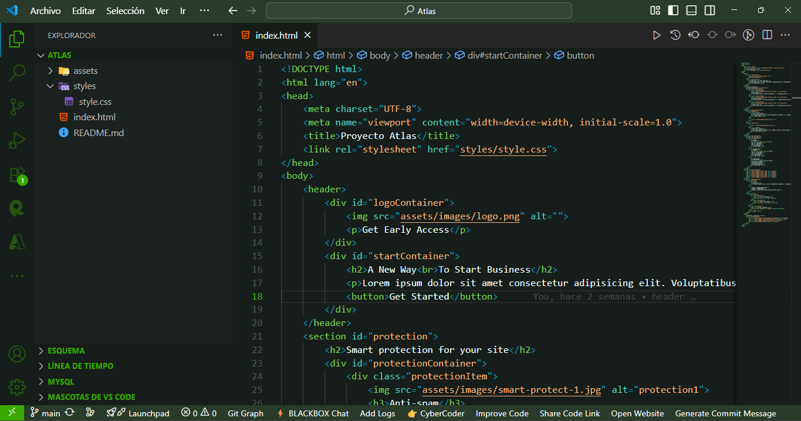
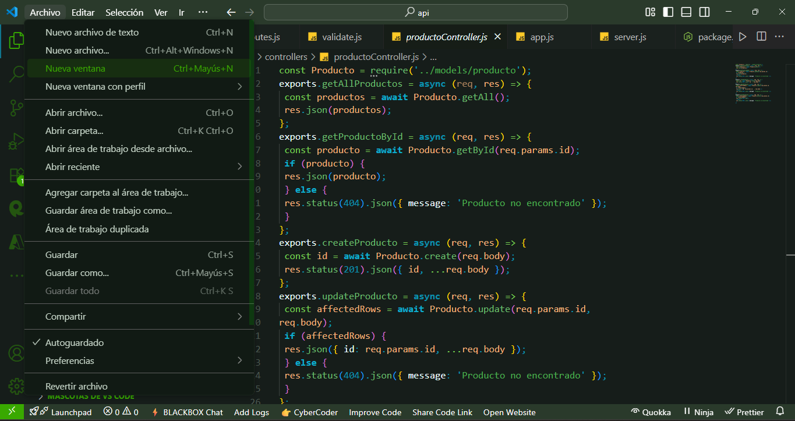

# 🎨 SENA ADSO Theme

¡Bienvenidos al tema visual **SENA ADSO**!  
Un tema diseñado especialmente para estudiantes y desarrolladores del programa **Análisis y Desarrollo de Software (ADSO)** del SENA.  
Colores pensados para ser agradables a la vista y mantener la concentración durante largas sesiones de código.

---

## 📸 Vista previa

> Capturas de ejemplo del tema en acción

  
  

---

## 📦 Instalación

1. Abre Visual Studio Code.
2. Ve a la **Extensiones** (`Ctrl+Shift+X` o `Cmd+Shift+X` en Mac).
3. Busca **SENA ADSO Theme**.
4. Haz clic en **Instalar** y luego en **Aplicar Tema**.

---

## ⚙️ Activar el tema

1. Abre la **Paleta de Comandos** (`Ctrl+Shift+P`).
2. Escribe `Preferences: Color Theme`.
3. Selecciona **SENA ADSO Theme**.

---

## 🤝 Contribuir

Si tienes sugerencias o mejoras para el tema:  
- Abre un **Issue** en el repositorio.
- O envía un **Pull Request**.

